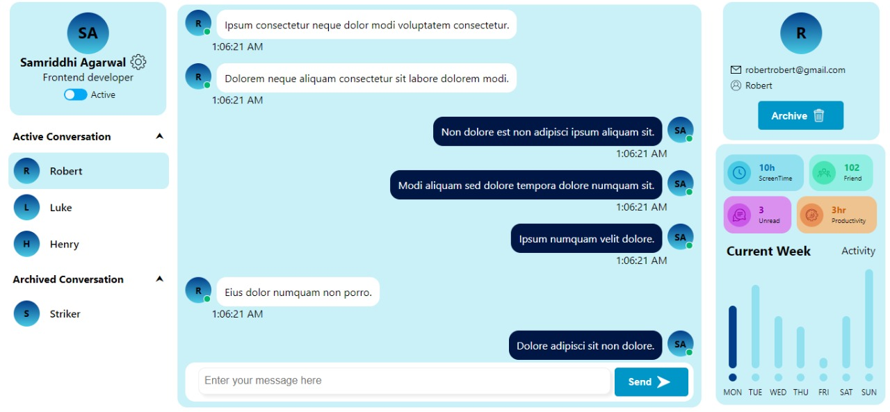
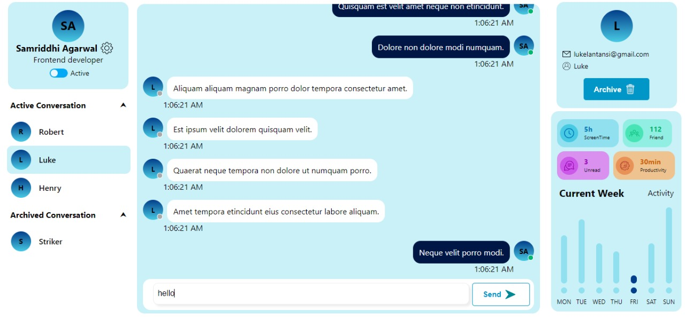

# Chat App Interface

## To start the project, run:

### `yarn start`

This runs the app in the development mode.\
Open [http://localhost:3000](http://localhost:3000) to view it in the browser.

## What it looks Like

The design is inspired by [dribble](https://urlf.in/dribble)

